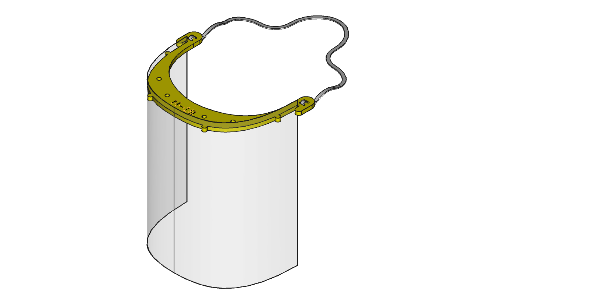
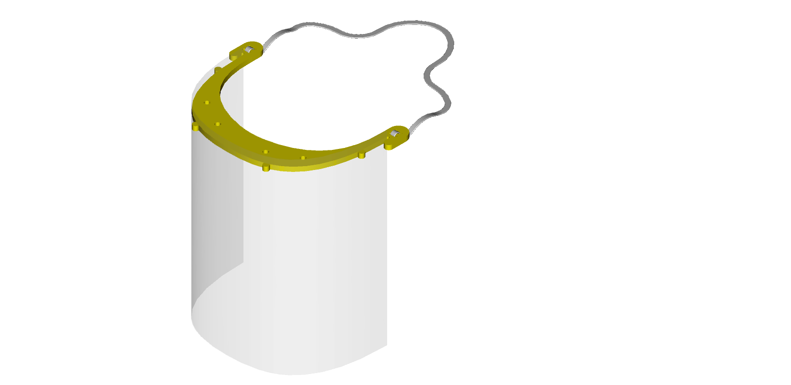
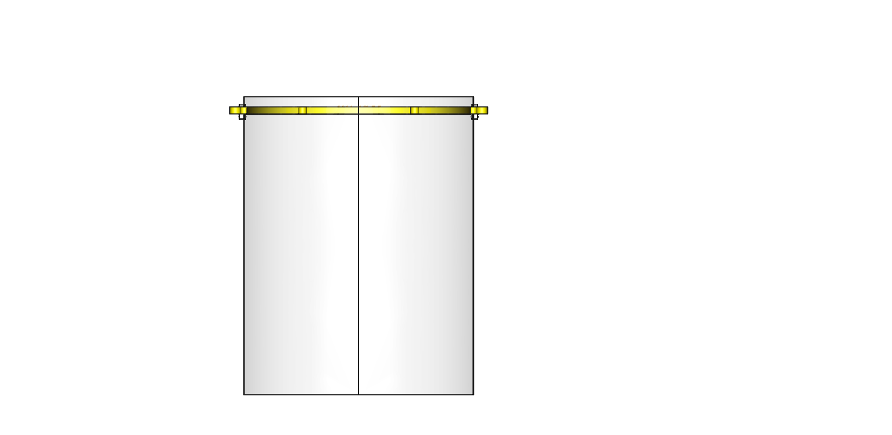
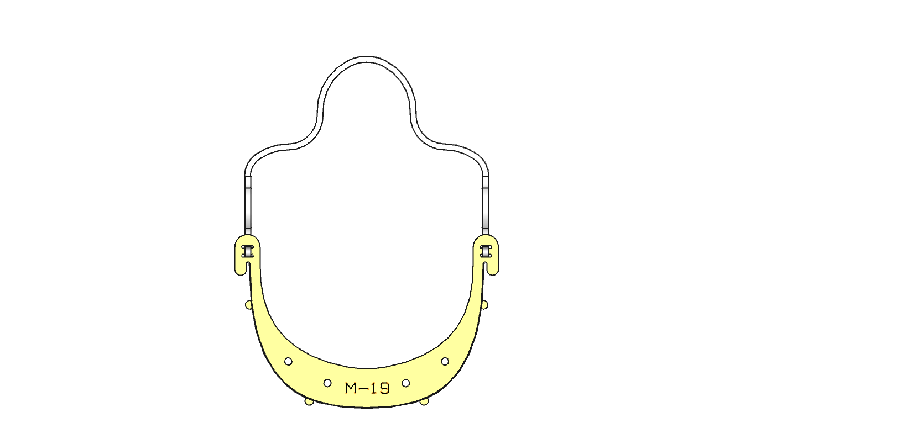
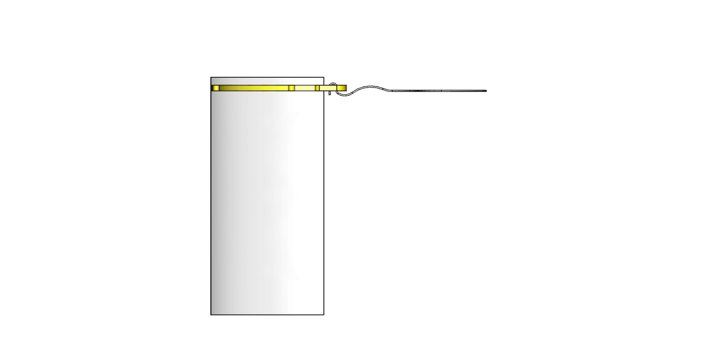

# Face Shield FOAM BOARD / SUN BOARD v100k Version #

## BoM ##

1. HEAD BAND : Foam Board / Sun Board sheet, between 3mm to 5mm thick, (RED is Engraved Text)
2. SHIELD : OHP Transparency Film, A4 Size, 175 microns thick (100 microns works)
    If you need a longer shield, use A3 sheet, and trim length as needed
3. RETENTION : Elastic Band or similar for retention, approx. 200 mm / 8 inches long
4. OPTIONAL : Foam strip, adhesive. To be stuck on the inside surface that touches forehead, for long duration comfort (not essential)

## ASSEMBLY ##

1. Laser Cut the foam head band.
2. Laser Cut the OHP film (holes to fit the tabs in the head band)
	a. ALTERNATIVELY, you can use a regular hole punch (commonly used to punch holes in paper for document filing).
	b. The punch hole locations are as per ISO 838 - four 6mm dia holes spaced 80 mm apart, spread out equidistant from centre of the paper.
	c. If you do not have a four hole punch, you can fold the OHP in half (do NOT crease it from the middle) and use the common hole punch machine. You may have to set a marking or gauge to punch the holes 28.5 from the edge of the OHP.
3. Soak in Soap water for 30 minutes, and then in clean water for 30 minutes.
4. Air dry in the Sun.
5. Attach the elastic retention band.
6. Apply foam along the area which comes in contact with the forehead. We used 2mm thick adhesive backed foam strips - about 10-15mm wide (approx 1/2 inch) and 200mm long (8 inches). This improves comfort over extended hours of use, but can be skipped, especially if the shield is already worn over other gear such as caps.
7. Snap fit the clear OHP film shields. If you're shipping these, you can pack the head bands and OHP films separately and the end user's can easily assemble before use.

## IMAGES ##

